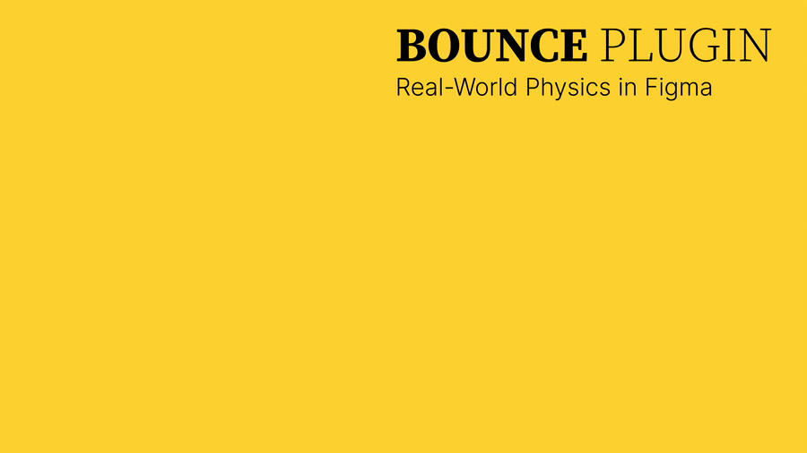
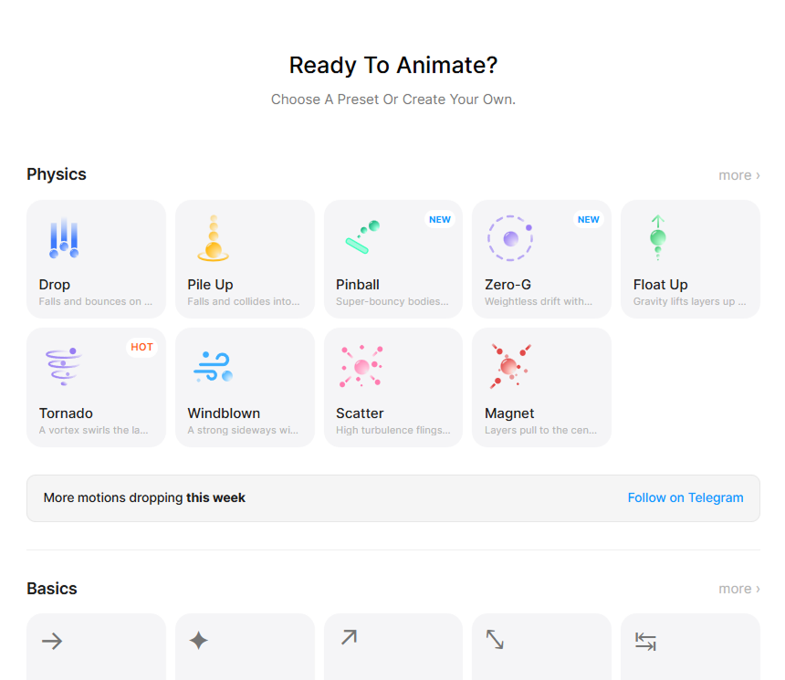
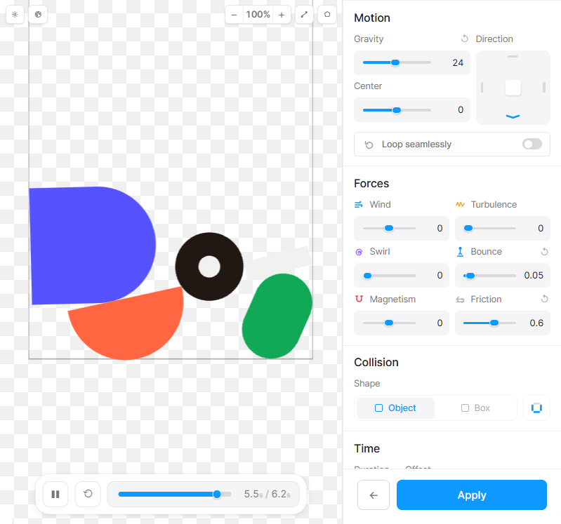

# Bounce

### Real Physics Animations & Motion Presets for Figma

**Drop, bounce, collide, throw, and spring your layers to life without hand-keyframing.**

Bounce turns Figma layers into physical objects, lets you direct the motion in a
live visual studio, and bakes the result into clean, editable native keyframes.

---

**Pick a scene. Shape the physics. Preview it live. Apply native keyframes.**

## Motion that behaves like it has weight

Bounce uses real 2D simulation instead of disguising easing curves as physics.
Gravity, wind, collisions, friction, density, turbulence, magnetism, and
restitution work together, so every layer reacts naturally to the scene around
it.

<table>
<tr>
<td width="50%" valign="top">

### Real physics studio

Build with directional or center gravity, wind, vortex forces, attraction,
repulsion, turbulence, floor and frame collisions, and custom timing.

</td>
<td width="50%" valign="top">

### Live, scrubbable preview

Play, pause, replay, scrub frame by frame, adjust speed, add settle time, and see
every physics change before applying it.

</td>
</tr>
<tr>
<td width="50%" valign="top">

### Native Figma keyframes

Bake the simulation into editable Figma keyframe tracks. Retiming and clearing
existing animations are available directly inside Bounce.

</td>
<td width="50%" valign="top">

### Web-ready export

Export a ready-to-run static HTML animation or a dynamic component that carries
the authored physics behavior into a web project.

</td>
</tr>
</table>

## More than presets

<table>
<tr>
<td width="50%" valign="top">

### Interact & record

Grab, move, and throw layers while the simulation runs. Record the result,
optionally capture the cursor, preview at quarter speed, restart freely, then
apply the performance as animation.

</td>
<td width="50%" valign="top">

### Per-layer physics

Give every object its own weight, bounce, friction, air drag, inertia,
turbulence, magnetism, start delay, collision shape, and collision rules.

</td>
</tr>
<tr>
<td width="50%" valign="top">

### Precise collisions

Choose fast bounding boxes or simplified real object outlines. Tune outline
detail, control each frame edge, pin layers as fixed obstacles, and decide which
objects can collide.

</td>
<td width="50%" valign="top">

### Ropes & relationships

Connect selected layers with adjustable ropes, choose attachment points, add
slack, and control whether neighboring items collide.

</td>
</tr>
<tr>
<td width="50%" valign="top">

### Timed explosions

Place blasts directly on the stage and tune their time, power, radius, falloff,
spin, and deterministic variation for repeatable results.

</td>
<td width="50%" valign="top">

### Visual editing workspace

Pan, zoom, select, transform, and organize layers in a dedicated stage. Use
undo/redo and inspect motion paths or collision fixtures while tuning the scene.

</td>
</tr>
</table>

## Inside Bounce

<table>
<tr>
<td width="50%">

<b>Start fast</b> Choose a complete physics scene or a classic motion preset.

</td>
<td width="50%">

<b>Make it yours</b> Direct the forces, materials, collisions, and timing with live feedback.

</td>
</tr>
</table>

## Physics scenes

Start from a complete scene, then change any force, material, collision, or
timing value without losing control.

| Category | Scenes | Best for |
| --- | --- | --- |
| **Gravity & Impact** | Soft Drop, Rubber Drop, Pile Up, Pinball, Float Up | Falls, rebounds, stacks, ricochets, and buoyant motion |
| **Air & Vortex** | Wind Tunnel, Tornado | Directional flow, drifting objects, and swirling systems |
| **Space & Forces** | Empty, Zero-G Drift, Gather, Repel | Custom setups, weightlessness, clustering, and scattering |

### Material presets

Apply a physical personality globally or to selected layers:

`Feather` · `Stone` · `Rubber` · `Ice` · `Foam` · `Sticky` · `Repelling` · `Chaotic`

## Motion presets

For polished interface motion without a full simulation, Bounce includes seven
free and unlimited presets.

| Entrance | Exit | Emphasis |
| --- | --- | --- |
| **Slide In** - directional movement with easing or bounce | **Slide Out** - move off toward any edge | **Shake** - decaying directional wobble |
| **Pop** - spring scale into place | **Zoom Out** - shrink and fade away | **Pulse** - quick attention beat |
|  |  | **Spin** - continuous or spring into place |

Motion presets support the controls that fit the effect, including direction,
distance, easing, spring feel, opacity, looping, turns, and spin direction.

## From selection to animation

1. **Select** one or more layers in Figma.
2. **Choose** a physics scene or motion preset.
3. **Direct** the scene with forces, materials, collisions, relationships, and timing.
4. **Preview** by playing, scrubbing, or physically interacting with the layers.
5. **Apply** the result as native Figma keyframes, or export it for the web.
6. **Refine** the baked animation by hand or retime it inside Bounce.

## Built for exploration, not lock-in

- **Editable output** - baked keyframes remain native and hand-editable.
- **Non-destructive preview** - experiment before committing animation to the file.
- **Layer-level control** - global settings stay fast while exceptions remain precise.
- **Repeatable results** - authored scenes, interactions, and randomized effects can be reproduced.
- **Light, dark, or automatic theme** - the plugin follows your preferred working environment.
- **Privacy by design** - document content stays inside Figma.

## Access

Motion presets are **free and unlimited**. Physics includes **one free apply per
UTC day**, with optional paid access for heavier use.

| Plan | Price | Access |
| --- | ---: | --- |
| **Free** | Free | 1 physics apply per UTC day |
| **Monthly** | $8 | 30 days of Physics Studio access |
| **Annual** | $65 | 1 year of Physics Studio access |
| **Lifetime** | $49 | Never expires; limited to the first 500 buyers |

A free 3-day trial is available through the Bounce Telegram community. Payments
use an external crypto checkout; Bounce does not collect card details or email
addresses.

## Team

| Name | Role | Profile |
| --- | --- | --- |
| **Nima Nazrii** | Developer | [LinkedIn](https://www.linkedin.com/in/nimanzrii) |
| **Nasi** | Designer | [LinkedIn](https://www.linkedin.com/in/nasiwho) |

## Links

- **Install** - [Bounce on Figma Community](https://www.figma.com/community/plugin/1659006442910568919)
- **Website** - [bouncefig.dpdns.org](https://bouncefig.dpdns.org)
- **Community** - [t.me/FigmaBounce](https://t.me/FigmaBounce)
- **Privacy** - [bouncefig.dpdns.org/#/privacy](https://bouncefig.dpdns.org/#/privacy)
- **Terms** - [bouncefig.dpdns.org/#/terms](https://bouncefig.dpdns.org/#/terms)
- **Contact** - [mail.nastaranjamali@gmail.com](mailto:mail.nastaranjamali@gmail.com)

---

### Stop drawing bounce curves. Start directing motion.

Copyright 2026 Bounce. All rights reserved.

